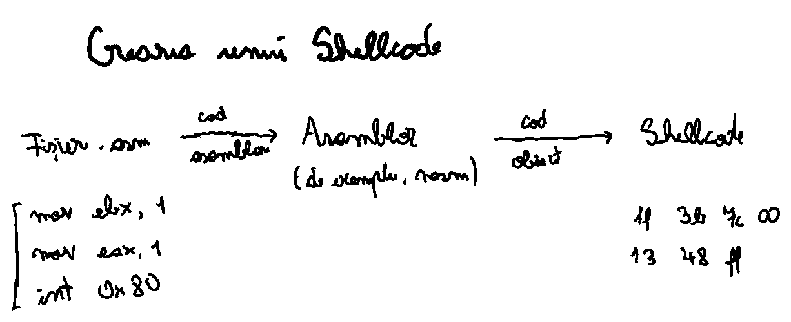
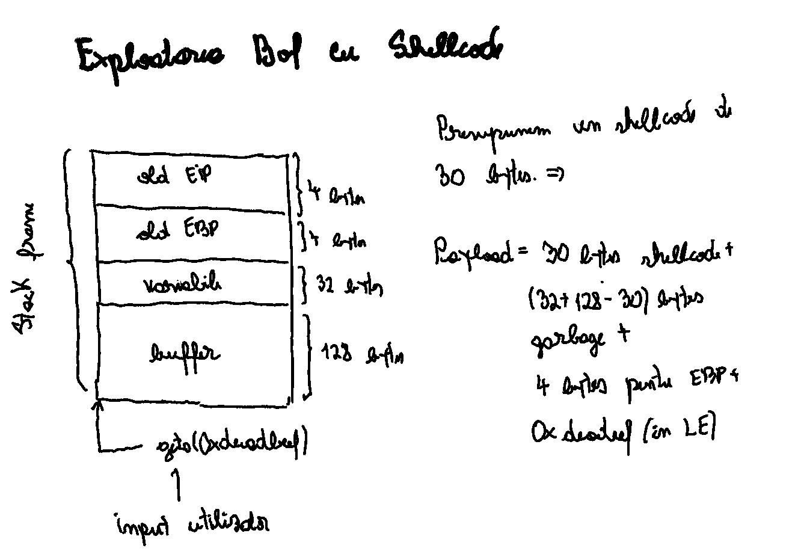

<!-- _class: lead invert -->

# **Laborator III: Suprascrierea Stivei. *Shellcodes***

---

# Tabelă de Conținut

1. Suprascrierea Stivei
2. *Shellcodes*
3. Exerciții
4. Exemplu Concret

---

<!-- _class: lead invert -->

# **Suprascrierea Stivei**

---

# Suprascrierea *Buffer*-ului

- **Buffer**: Zonă temporară de memorie, folosită la un moment dat pentru procesarea sau mutarea datelor.
- **Suprascrierea Buffer-ului**: Scrierea într-un *buffer* a unor date care depășesc limitele acestuia, suprascriind astfel zone de memorie vecine.
- Poate apărea la limbaje de programare care nu efectuează o verificare automată a limitelor zonelor de memorie în care se scrie (de exemplu, Assembly, C și C++).

---

# Categorii de Suprascrieri

- **În Stivă**: Zona de memorie suprascrisă aparține de stiva procesului, *buffer*-ul fiind o variabilă locală.
- **În *Heap***: Zona de memorie suprascrisă aparține de *heap*, *buffer*-ul fiind o variabilă alocată dinamic.
- **La Nivel de Tip de Date**: Efectuarea de operațiuni care rezultă într-o valoare ce nu poate fi salvată într-un anumit tip de date. De exemplu, `(char)(2 * 128)`  e egal cu `0`.

---

# Impact

- Modificarea unor variabile
    - Referințe către funcții
    - Canarii
- Modificarea adreselor de retur

---

# Mitigări

- Impunerea unei lungimi maxime la copierea în *buffer*
- Folosirea unor mecanisme de securitate precum:
    - Canarii, impuse la nivel de compilator
    - Data Execution Prevention, implementate la nivel de sistem de operare (Windows)
    - Bitul NX în intrările din tabelele de pagini

---

<!-- _class: lead invert -->

# ***Shellcodes***

---

# *Shellcodes*

- ***Shellcode***: Secvență de coduri de operații folosită în exploatarea de programe pentru efectuarea unor sarcini (de obicei, deschiderea unui *shell*).
- Scris în Assembly (recomandat datorită controlului mai mare), eventual în C (rezultatul depinde de compilator)

---

<!-- _class: lead -->

---

<!-- _class: lead -->

---

# Limitări în Scrierea *Shellcode*-urilor

- Dimensiunea *buffer*-ului
- Posibilitatea interpretării unor octeți ca terminator de șir
- Detectabilitatea operațiunilor efectuate de către soluțiile de securitate

---

<!-- _class: lead invert -->

# **Exerciții**

---

# Recomandări

- Folosiți comanda `man` pentru a primi ajutor la rularea anumitor comenzi.
- Folosiți documentația [pwntools](https://docs.pwntools.com/en/stable/) pentru a identifica metodele de care aveți nevoie.

---

<!-- _class: lead invert -->

---

<!-- _class: lead invert -->

# **Exemplu Concret**

---

# RCE în Aplicația Client Steam

- [Vulnerabilitate raportată](https://hackerone.com/reports/470520) în 2019, pe HackerOne
- CVSS de 9.6
- Protocol proprietar pentru descoperirea serverelor de jocuri

---

# Metodă de Exploatare

1. *Fuzzing* efectuat pe protocol pentru a identifica un câmp vulnerabil, specific numelui de utilizator
2. Suprascrierea *buffer*-ului la nivel de stivă
3. Depășirea unor limitări provocate de conversia Unicode a numelui (în acest caz, a *payload*-ului) și de caracterele `NULL`
4. Folosirea unui *shellcode* pentru lansarea `cmd.exe`