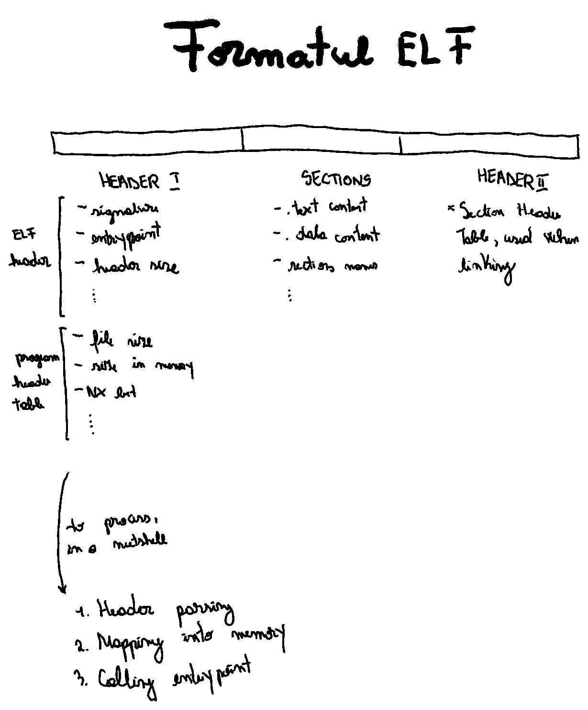
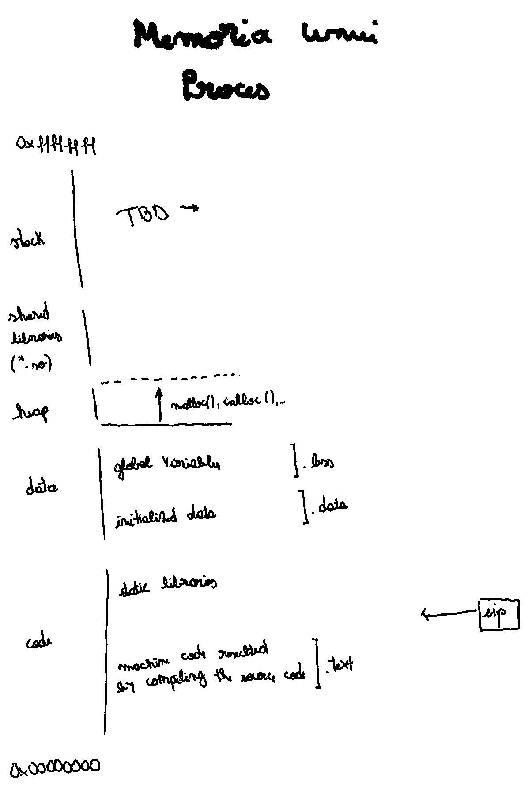
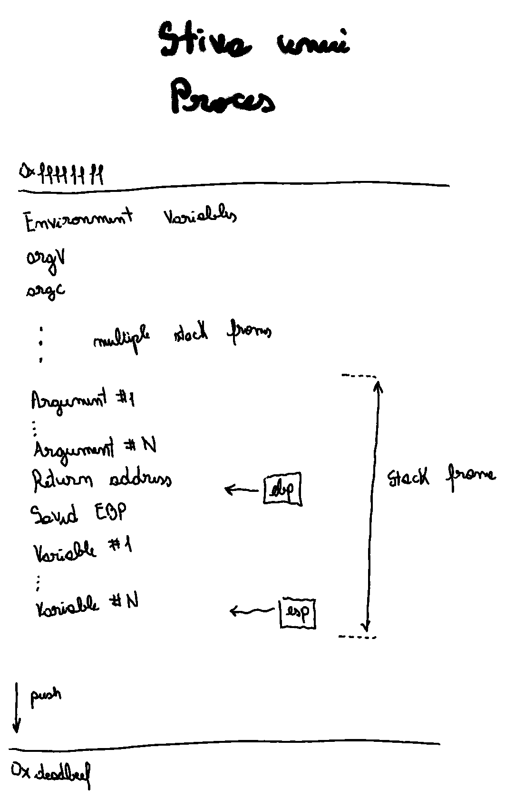
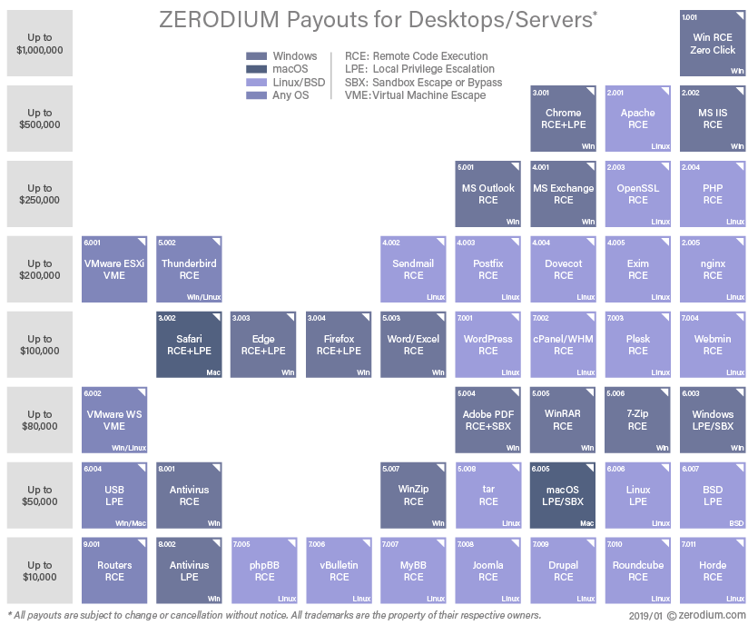
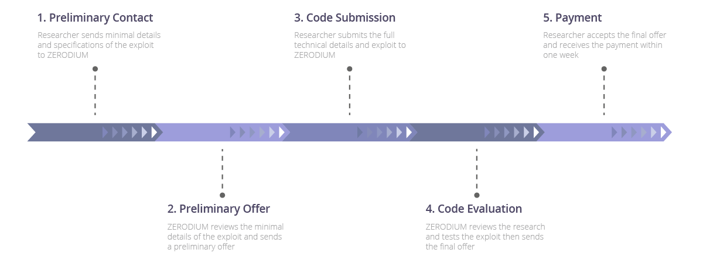
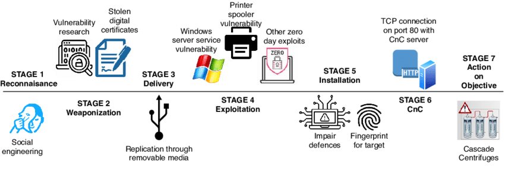

<!-- _class: lead invert -->

# **Laborator I: Introducere**

---

# Tabelă de Conținut

1. BinExpLabs 101
2. Noțiuni Introductive
3. Exploatarea Executabilelor
4. Instrumente
5. Exerciții

---

<!-- _class: lead invert -->

# **BinExpLabs 101**

---

# Notarea

- Nota celor 4 laboratoare va fi obținută în sesiune.
- Examenul va fi format din:
  - Întrebări cu răspuns liber, din subiectele deja discutate; și
  - Exercițiu practic, cu *walktrough*.

---

# Regulile Jocului

- Sau **Human Relations 101**
- Pași
    1. Definește care este scopul celeilalte persoane.
    2. Conștientizează-ți scopul personal.
    3. Presară empatie pentru a-ți îndeplini scopul, dar respectând scopul celeilalte persoane.
    4. *Be human* ✨.

---

# *Must-have*

- Resurse
    - Mașină virtuală cu Linux (cu suport de Intel pe 32 de biți)
    - Python 3 cu librăria `pwntools`
    - Ghidra
    - PEDA

---

# *Nice-to-have*

- Cunoștințe
    - Limbaj de asamblare
    - Sisteme de operare
- Experiență
    - Linux
    - Python 3

---

# Tematicile Laboratoarelor

1. Introducere
2. Tehnici de Descoperire a Vulnerabilităților
3. Exploatarea Suprascrierii Stivei. Shellcodes
4. Mecanisme de Protecție

---

# [Wiki](https://github.com/iosifache/BinExpLabs/wiki)

- Pentru fiecare laborator:
  - Prezentare
  - Cerințele exercițiilor
- Ghiduri, dintre care:
  - Setarea mediului de lucru
  - Rezolvarea unor probleme uzuale (FAQ)
- Resurse

---

# [Repository](https://github.com/iosifache/BinExpLabs)

- Pentru fiecare laborator:
  - ~~Fișierele necesare exercițiilor~~
  - *Release*

---

<!-- _class: lead invert -->

# **Noțiuni Introductive**

---

# Procese

- **Proces**: Set de instrucțiuni ce sunt grupate pentru a fi executate
    pe procesor, în cadrul sistemului de operare gazdă, cu scopul de a
    transforma date de intrare în date de ieșire.

---

# Executabile

- **Executabil**: Fișier care încapsulează instrucțiuni ce trebuiesc executate de procesor și pe baza căruia este creat un proces. Numit și binar.
- Cele mai comune formate
    - Portable Executable (abreviat PE, specific Windows)
    - Executable and Linkable Format (abreviat ELF, specific Unix)

---

<!-- _class: lead -->

---

<!-- _class: lead -->

---

<!-- _class: lead -->

---

<!-- _class: lead invert -->

# **Exploatarea Executabilelor**

---

# Terminologie

- **Vulnerabilitate**: Slăbiciune a unui sistem informatic, ce poate provoca o funcționare incorectă a lui.
- **Exploatare**: Atacarea cu succes a unui sistem informatic, prin intermediul unei vulnerabilități.
- **Exploatarea Executabilelor**: Provocarea de către un atacator a execuției incorecte a unui executabil.

---

# Suprafața de Atac

- **Suprafața de Atac**: Set de puncte (numite vectori de atac) de la marginea unui sistem informatic pe care un atacator le poate folosi pentru a interacționa cu el (obținerea accesului, extragerea datelor, perturbarea funcționării).

---

# Vectori Uzuali de Atac

- `stdin`
- Argumente
- Variabile de mediu
- Fișiere (de configurație, baze de date etc.)
- Dispozitive
- Întreruperi
- Acțiuni în interfața grafică

---

# Motivație

- Înțelegerea mentalității de atacator
- *Bug bounty*
    - CVE−2022-3602, ca suprascriere a stivei în OpenSSL, cu CVSS 7.5, ce permite execuția de cod de la distanță pe unele dispozitive
- *Zero days*
    - *Marketplaces*, precum Zerodium
    - Utilizarea în atacuri avansate, precum Stuxnet

---

<!-- _class: lead -->

# Sume Oferite de Zerodium

---

<!-- _class: lead -->

# Procesul de Vânzare în Zerodium

---

<!-- _class: lead -->

# *Killchain*-ul Stuxnet

---

<!-- _class: lead invert -->

# **Instrumente**

---

# Pur Statice

- `strings`: Extragerea șirurilor de caractere printabile din
    fișiere.
- `nm`: Extragerea simbolurilor din fișierele obiect (atât
    executabile, cât și librării).
- `ldd`: Extragerea dependințelor către librării dinamice.
- `objdump`: Extrage informații din fișiere obiect. Poate fi
    folosit pentru dezasamblare.
- `Ghidra`: Efectuează operațiuni de inginerie inversă, inclusiv dezasamblare și decompilare.

---

# Pur Dinamice

- `ltrace`: Interceptează apeluri către librării dinamice.
- `strace`: Interceptează apeluri de sistem.
- `netstat`: Oferă detalii despre rețelistică, util pentru
    urmărirea conexiunilor efectuate.
- `gdb`: Depanează programe, putând fi folosit împreună cu
    PEDA.

---

# Altele

- `pwntools`: Fiind o librărie Python 3, ușurează exploatarea
    programelor.
- `man`: Afișează manualele comenzilor.

---

<!-- _class: lead invert -->

# **Exerciții**

---

# Recomandări

- Folosiți comanda `man` pentru a primi ajutor la rularea anumitor comenzi.
- Folosiți documentația [pwntools](https://docs.pwntools.com/en/stable/) pentru a identifica metodele de care aveți nevoie.

---

<!-- _class: lead invert -->

