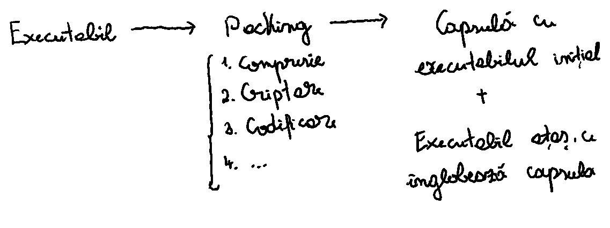
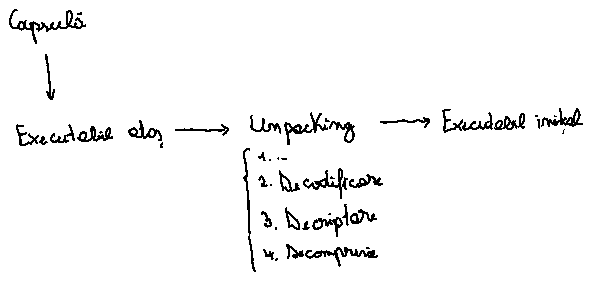
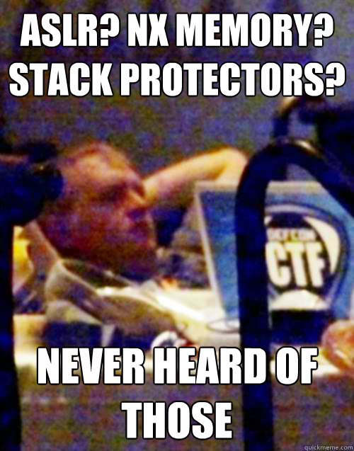

<!-- _class: lead invert -->

# **Laborator IV: Mecanisme de Protecție**

---

# Tabelă de Conținut

1. Eliminarea Informațiilor
2. Împachetare
3. Canarii
4. Address Space Layout Randomization
5. Bitul NX
6. Exerciții

---

<!-- _class: lead invert -->

# **Eliminarea Informațiilor**

---

# Informații Redundante în Executabile

- Execuția nu necesită toate informațiile existente într-un executabil.
    - Numele unor simboluri (din secțiunile `.symtab` și `.dynsym`)
    - Informații pentru depanare (din secțiunile specifice formatului DWARF, numite `.debug_*`)

---

# Eliminarea Informațiilor

- Măsură de securitate aplicată după compilarea executabilului și înainte de distribuirea lui către utilizatori
- Avantaje
    - Reducerea dimensiunii executabilului
    - Execuție mai rapidă
    - Dezvăluirea a cât mai puține informații către utilizatori (eventual și atacatori)

---

# Instrumente

- `strip`
- `gcc -s`

---

<!-- _class: lead invert -->

# **Împachetare**

---

# Împachetare

- Mecanism care comprimă executabilul curent, încorporând rezultatul într-un alt executabil (care se ocupă numai de despachetare)
- Despachetare în memorie sau în fișier temporar
- Ultimate Packer for eXecutables (abreviat UPX) ca cel mai cunoscut utilitar multi-platformă pentru împachetare

---

<!-- _class: lead -->

---

<!-- _class: lead -->

---

# Roluri

- Reducerea dimensiunii executabilului și îngreunarea analizei de către posibili atacatori
- Reducerea dimensiunii programelor malițioase și îngreunarea analizei de către analiștii de securitate

---

<!-- _class: lead invert -->

# **Canarii**

---

<!-- _class: lead -->

---

# Canarii

- Nume provenit de la păsările care intrau înaintea minerilor în subteran, pentru a detecta niveluri prea mari de gaz
- Mecanismul constă în plasarea unor valori pe stivă, pentru a detecta tentativele de suprascriere.

---

# Valori ale Canariilor

- Fixe, de obicei un terminator pentru posibile funcții de copiere a șirurilor de caractere
- Aleatorii, de exemplu din `/dev/urandom`
- Altele, de exemplu rezultate ale unor `xor`-uri

---

# Tehnici de Evaziune

- Deducerea valorii de canar
- Folosirea de atacuri care pot scrie la o anumită zonă de memorie (de exemplu, cele cu șiruri de caractere de formatare)

---

<!-- _class: lead invert -->

# **Address Space Layout Randomization**

---

# Address Space Layout Randomization

- Constă în maparea segmentelor executabilului la adrese aleatorii de memorie.
- Verificarea activării prin citirea conținutului `/proc/sys/kernel/randomize_va_space`

---

# Segmente Vizate

- Stivă
- Librării dinamice (cu ajutorul secțiunilor `.plt` și `.got`)
- *Heap*
- Cod (numai la activarea mecanismului Position Independent Code)

---

# Tehnici de Evaziune

- Atacuri cu forță brută
- `nop` *sled*
- `jmp esp` sau `call esp`
- Obținerea unor informații despre memoria procesului

---

<!-- _class: lead invert -->

# **Bitul NX**

---

# Bitul NX

- Prezența lui implică imposibilitatea unei pagini de a avea drepturi de scriere și execuție în același timp.

---

# Tehnici de Evaziune

- Atacuri de tip Return Oriented Programming (abreviat ROP)
- Apeluri către `mprotect`
- Atacuri de tip Return-to-libc

---

<!-- _class: lead invert -->

# **Exerciții**

---

# Recomandări

- Folosiți comanda `man` pentru a primi ajutor la rularea anumitor comenzi.
- Folosiți documentația [pwntools](https://docs.pwntools.com/en/stable/) pentru a identifica metodele de care aveți nevoie.

---

<!-- _class: lead invert -->

