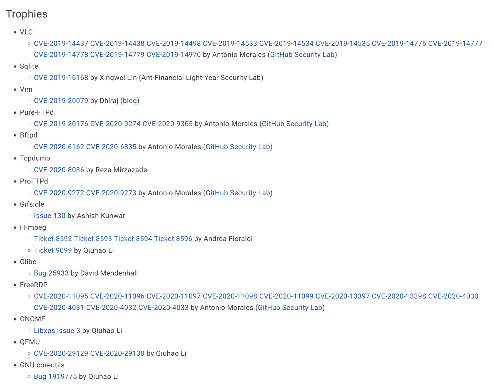

<!-- _class: lead invert -->

# **Laborator II: Tehnici de Descoperire a Vulnerabilităților**

---

# Tabelă de Conținut

1. Vulnerabilități
2. Tehnici de Descoperire a Vulnerabilităților
   1. Fuzzing
   2. Analiza Fluxului Datelor
   3. Execuție Simbolică
   4. Revizuirea Codului Sursă
   5. Analiza *Crash*-urilor
3. Exerciții

---

<!-- _class: lead invert -->

# **Vulnerabilități**

---

# Recapitulare

- Proces
- Executabil
- Vulnerabilitate
- Exploatarea executabilelor
- Suprafață de atac
- Vectori uzual de atac la executabile

---

# Suprascrierea Stivei

- **Funcționare**: citirea unor date de lungime prea mare într-un buffer neîncăpător, alocat pe stivă
- **Impact**: suprascrierea unor variabile, a valorii vechi a stivei sau chiar a adresei de retur

```
char last_name[20];

printf ("Enter your last name: ");
scanf ("%s", last_name);
```

---

# Suprascrierea Întregilor

- **Funcționare**: depășirea limitelor valorilor ce pot fi stocate într-un întreg, în cazul procesării (de exemplu, înmulțire cu altă valoare) acestuia
- **Impact**: suprascrieri de *buffers*, alte vulnerabilități logice

```
// Excerpt from OpenSSH 3.3
nresp = packet_get_int();
if (nresp > 0) {
  response = xmalloc(nresp*sizeof(char*));
  for (i = 0; i < nresp; i++) response[i] = packet_get_string(NULL);
}
```

---

# Atacuri Cu Șirurilor de Formatare

- **Funcționare**: folosirea unor funcții specifice (de exemplu, `printf`, cu un șir de formatare provenit de la utilizator)
- **Impact**: suprascrieri de *buffers*, vizualizarea memoriei procesului

```
int main(int argc, char **argv){
  char buffer[128];
  char api_key[32];

  [...]

  snprintf(buffer, 128, argv[1]);
}
```

---

<!-- _class: lead invert -->


---

<!-- _class: lead invert -->


---

<!-- _class: lead invert -->

# **Tehnici de Descoperire a Vulnerabilităților**

---

# Tehnică de Descoperire a Vulnerabilităților

- **Tehnică de Descoperire a Vulnerabilităților**: Metodă prin care se folosesc secvențe de intrări (parte a suprafeței de atac) care, odată transmise procesului, acesta se comportă incorect.
- Sunt folosite:
    - Extern de atacatori și bug bounty hunters
    - Intern, de cercetători de securitate

---

# *Fuzzing*

- Reprezintă generarea (cu ajutorul unui algoritm) de intrări ce vor fi oferite unui proces.
- Rezultatul este o parcurgere în lățime a grafului format din secvențele de instrucțiuni executate (engl. *control-flow graph*).

---

<style scoped>
section {
    background-color: #fff;
}
</style>

<!-- _class: lead -->

# Arhitectura unui *Fuzzer*


---

# Tipuri de *Fuzzers*

- Cunoașterea codului sursă: *blackbox*, *whitebox* și *graybox*
- Cunoașterea formatului de intrare: *smart* și *dumb*
- Cunoașterea stării programului: *stateless* și *stateful*
- În funcție de suprafața de atac: pentru GUI, de rețea, de fișiere etc.

---

<style scoped>
section {
    background-color: #fff;
}
</style>

<!-- _class: lead -->

# AFL++


---

<style scoped>
section {
    background-color: #fff;
}
</style>

<!-- _class: lead -->

# CVE-uri Descoperite cu AFL++



---

# Analiza Fluxului Datelor

- În engleză, *taint analysis*
- Reprezintă procesul de descoperire a fluxului de date într-un proces.
- Se poate executa:
    - Static, analizând codul sursă al programului
    - Dinamic, instrumentând execuția și urmărind fluxul datelor în timp real.

---

<style scoped>
section {
    background-color: #fff;
}
</style>

<!-- _class: lead -->

# Triton


---

# Analiza Fluxului Datelor cu Triton

```
triton::Context ctx;

ctx.setArchitecture(ARCH_X86_64);

ctx.taintRegister(ctx.registers.x86_ah);

// Execute until a chosen moment. Then stop the execution.

bool is_tainted = ctx.isRegisterTainted(ctx.registers.x86_rdx);
```

---

# Execuție Simbolică

- Constă în utilizarea unor valori simbolice (față de cele concrete, folosite la *fuzzing*), pentru reprezentarea unor date de intrare.
- Menține căi pentru care programul a ajuns în anumite puncte, reținând în același timp și intrările corespunzătoare.
- Tipuri
    - *Offline*: Programul este rulat, se generează fișiere de *tracing*, iar analiza este efectuată pe ele.
    - *Online*: Analiza este efectuată în timpul rulării programului.

---

<style scoped>
section {
    background-color: #fff;
}
</style>

<!-- _class: lead -->


---

<style scoped>
section {
    background-color: #fff;
}
</style>

<!-- _class: lead -->

# angr


---

# Cod Analizat cu angr

```
char *sneaky = "SOSNEAKY";

int authenticate(char *username, char *password){
  if (strcmp(password, sneaky) == 0) return 1;

  // Check the password stored into a shadow file.
}
```

---

# Execuția Simbolică Folosind angr

```
proj = angr.Project('fauxware', auto_load_libs=False)
state = p.factory.entry_state()
manager = proj.factory.simulation_manager(state)

# Symbolically execute the program until we reach a branch
# statement for which both branches are satisfiable.
manager.run(until=lambda sm_: len(sm_.active) > 1)

input_0 = manager.active[0].posix.dumps(0)
input_1 = manager.active[1].posix.dumps(0)

[...]
```

---

# Revizuirea Codului Sursă

- Constă într-un proces de analiză a codului sursă.
- Tipuri
    - Manual, folosind, de exemplu, experiența unui senior
    - Automat, folosind instrumente de analiză
- Exemple de categorii de instrumente
    - *Linters*
    - Interogatoare de cod

---

# Interogarea Codului cu Joern

Următoarea interogare CPGQL

```
({
  cpg.method("(?i)printf").callIn
    .whereNot(_.argument.order(1).isLiteral)
}).l
```

va detecta vulnerabilitatea de mai jos

```
printf(argv[1], 4242);
```

---

<style scoped>
section {
    background-color: #fff;
}
</style>

<!-- _class: lead -->

# Analiza *Crash*-urilor


---

<!-- _class: lead invert -->

# **Exerciții**

---

# Recomandări

- Folosiți comanda `man` pentru a primi ajutor la rularea anumitor comenzi.
- Folosiți documentația [pwntools](https://docs.pwntools.com/en/stable/) pentru a identifica metodele de care aveți nevoie.

---

<!-- _class: lead invert -->

